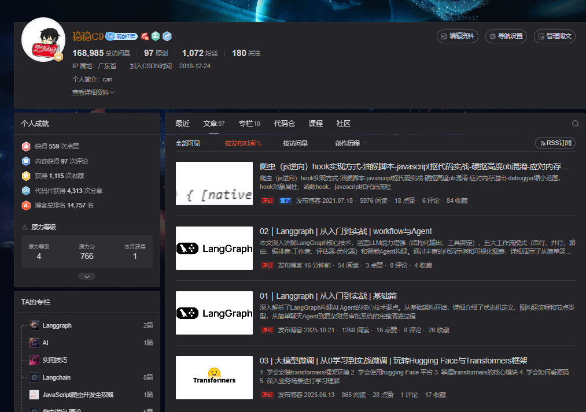

# 一、项目说明



配合博客文章讲解，点击专栏，langgraph，跟着系列文章运行响应代码即可
https://blog.csdn.net/weixin_44238683


# 二、环境设置

1、安装UV
```bash
pip install uv
```

2、创建python环境
```bash
uv venv --python=3.13
```

3、激活虚拟环境
```bash
.venv\Scripts\activate
```

4、安装包 【使用清华源】
```bash
uv  sync  -i https://pypi.tuna.tsinghua.edu.cn/simple
```
